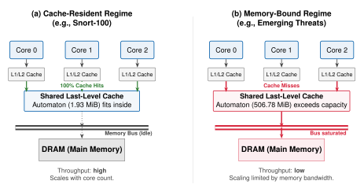
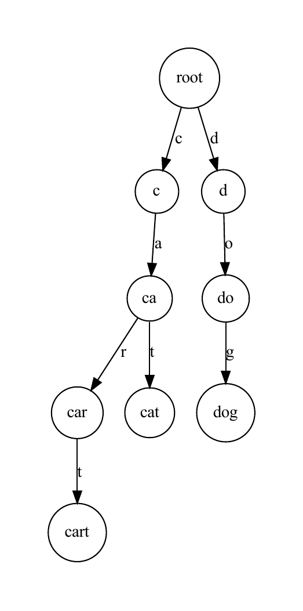
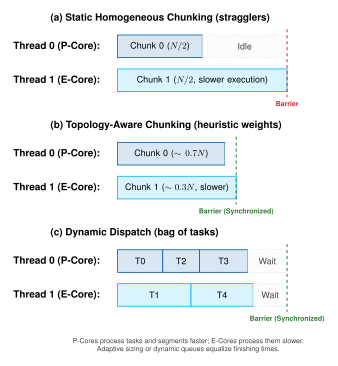
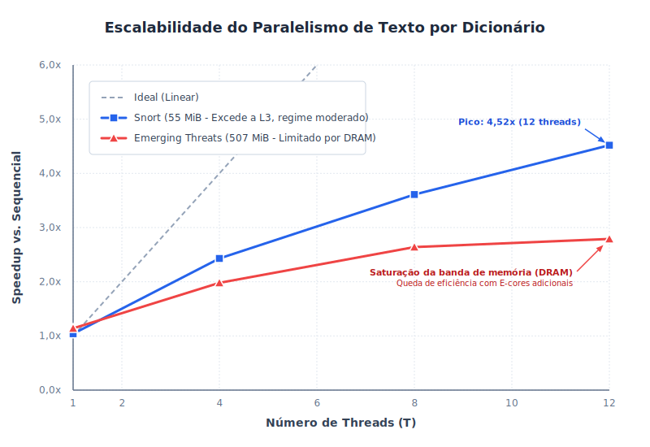
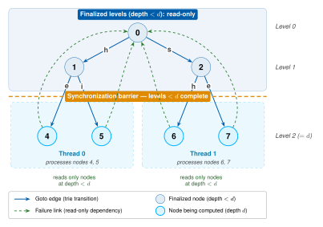

<!-- _class: cover -->
<!-- _header: "" -->
<!-- _footer: "" -->

# Acceleration of Pattern Matching Algorithms<br>Using Parallel Programming

## Paralelização do algoritmo Aho–Corasick em CPUs multi-core de memória compartilhada com POSIX Threads

<div class="info-box">
  <div class="info-item">
    <strong>Autor</strong>
    Matheus Antônio de Castro de Barros
  </div>
  <div class="info-item">
    <strong>Orientador</strong>
    Jeremias Moreira Gomes
  </div>
  <div class="info-item">
    <strong>Instituição</strong>
    IDP — Engenharia de Software
  </div>
  <div class="info-item">
    <strong>Finalidade</strong>
    Defesa de Trabalho de Conclusão de Curso (TCC)
  </div>
</div>

---

# Agenda / Roteiro da Apresentação

<div class="grid">
  <div class="col">
    <div class="card">
      <div class="card-header">1. Introdução e Problema</div>
      <ul>
        <li>Contexto de hardware multi-core</li>
        <li>O algoritmo Aho–Corasick</li>
        <li>O regime <em>memory-bound</em></li>
        <li>Objetivos & Questões de Pesquisa (RQs)</li>
      </ul>
    </div>
    <div class="card">
      <div class="card-header">2. Fundamentos e Literatura</div>
      <ul>
        <li>Princípios de funcionamento e DFA</li>
        <li>Hierarquia de cache e CPUs híbridas</li>
        <li>Revisão Sistemática da Literatura (RSL)</li>
      </ul>
    </div>
  </div>
  <div class="col">
    <div class="card">
      <div class="card-header">3. Proposta e Metodologia</div>
      <ul>
        <li>Decisões de design e paralelismo de texto</li>
        <li>Otimização de layout de saída (Flat Layout)</li>
        <li>Ambiente de testes (Intel i5 Alder Lake)</li>
      </ul>
    </div>
    <div class="card">
      <div class="card-header">4. Resultados e Conclusão</div>
      <ul>
        <li>Footprint do autômato vs. Throughput</li>
        <li>Escalabilidade e saturação da DRAM</li>
        <li>Resultados negativos (Sharding/Composição 2D)</li>
        <li>Validação e Trabalhos Futuros</li>
      </ul>
    </div>
  </div>
</div>

---

# Contexto: A Transição para Arquiteturas Multi-core

<div class="grid">
  <div class="col-65">
    <ul>
      <li><strong>Estagnação do clock em meados de 2000:</strong> Limites térmicos e físicos impediram o aumento infinito da frequência de operação das CPUs.</li>
      <li><strong>A era multi-core:</strong> A indústria respondeu adicionando múltiplos núcleos de processamento por chip em vez de acelerar um único núcleo.</li>
      <li><strong>O desafio do software:</strong> Para obter ganhos de desempenho, o software não ganha mais aceleração "de graça"; ele precisa ser explicitamente projetado para execução paralela.</li>
      <li><strong>Memória Compartilhada:</strong> Sistemas <em>commodity</em> modernos compartilham a RAM entre os núcleos, gerando potencial concorrência sobre o barramento.</li>
    </ul>
  </div>
  <div class="col-35">
    <div class="metric-box">
      <div class="metric-value">2005</div>
      <div class="metric-label">Início da transição dominante para arquiteturas multi-core</div>
    </div>
    <div class="metric-box" style="background-color: #fffbeb; border-left-color: #f59e0b;">
      <div class="metric-value" style="font-size: 20px;">Frequência → Núcleos</div>
      <div class="metric-label">O ganho de desempenho deixou de vir do clock e passou a depender do paralelismo explícito</div>
    </div>
  </div>
</div>

---

# O Algoritmo Aho–Corasick: Eficiente, porém Sequencial

<div class="grid">
  <div class="col-60">
    <ul>
      <li><strong>Aho-Corasick (AC):</strong> Algoritmo de casamento de múltiplos padrões em tempo linear <em>O</em>(<em>n</em> + <em>z</em>), realizando a busca em uma única passada pelo texto.</li>
      <li><strong>Aplicações Críticas:</strong> Espinha dorsal de sistemas de segurança como <strong>Snort/Suricata (NIDS)</strong>, YARA (detecção de malware), filtros de spam e bioinformática.</li>
      <li><strong>A Limitação Sequencial:</strong>
        <ul>
          <li>O autômato avança estritamente caractere por caractere (da esquerda para a direita).</li>
          <li>Cada transição depende do estado anterior.</li>
          <li>Isso torna o algoritmo <strong>intrinsecamente sequencial</strong>, utilizando apenas <strong>1 núcleo</strong> do hardware moderno.</li>
        </ul>
      </li>
    </ul>
  </div>
  <div class="col-40">
    <div class="card">
      <div class="card-header">Aplicações do Aho–Corasick</div>
      <ul style="margin: 0; font-size: 15px;">
        <li>Snort / Suricata — IDS de rede (NIDS)</li>
        <li>YARA — classificação de malware</li>
        <li>Filtros de spam e antivírus</li>
        <li>Bioinformática — busca de motivos em DNA</li>
      </ul>
    </div>
    <div class="metric-box negative">
      <div class="metric-value" style="font-size: 22px;">1 núcleo</div>
      <div class="metric-label">Sequencial por natureza: usa apenas um núcleo, mesmo em CPUs multi-core</div>
    </div>
  </div>
</div>

---

# Problema e Motivação: O Regime Memory-Bound

<div class="grid">
  <div class="col-40">
    <ul style="font-size: 18px;">
      <li><strong>Crescimento de Assinaturas:</strong> Dicionários de NIDS geram autômatos de <strong>centenas de megabytes</strong>.</li>
      <li><strong>Estouro da Cache L3 (LLC):</strong> Quando o autômato ultrapassa a cache, entra em <strong><em>memory-bound</em></strong>.</li>
      <li><strong>Saturação do Barramento:</strong> Cada byte processado exige ir à DRAM, gargalando a largura de banda.</li>
      <li><strong>Falta de Caracterização:</strong> Lacuna na avaliação desse limite em <strong>CPUs híbridas modernas</strong>.</li>
    </ul>
  </div>
  <div class="col-60" style="text-align: center;">
    
  </div>
</div>

---

# Objetivos do Trabalho

<blockquote>
  <strong>Objetivo Geral:</strong> Projetar, implementar e avaliar uma versão paralela do algoritmo Aho–Corasick para CPUs multi-core de memória compartilhada usando POSIX Threads (pthreads), a fim de acelerar o casamento de múltiplos padrões sobre entradas grandes.
</blockquote>

### Objetivos Específicos:

<div class="grid">
  <div class="col">
    <div class="card">
      <div class="card-header text-blue">1. Implementar</div>
      <p style="font-size: 15px; margin: 0;">Construir a versão paralela em C com a API pthreads, explorando o paralelismo intra-entrada sobre um autômato compartilhado.</p>
    </div>
  </div>
  <div class="col">
    <div class="card">
      <div class="card-header text-blue">2. Quantificar</div>
      <p style="font-size: 15px; margin: 0;">Medir os ganhos em <em>speedup</em>, <em>throughput</em> e eficiência paralela, sempre contra um baseline sequencial validado.</p>
    </div>
  </div>
  <div class="col">
    <div class="card">
      <div class="card-header text-blue">3. Analisar</div>
      <p style="font-size: 15px; margin: 0;">Avaliar a escalabilidade sob diferentes <em>workloads</em>, conjuntos de padrões e números de threads.</p>
    </div>
  </div>
</div>

---

# Fundamentação: O Aho–Corasick em uma Figura

<div class="grid">
  <div class="col-35">
    <ul>
      <li><strong>Trie Inicial:</strong> árvore de prefixos gerada a partir do dicionário de padrões (função <em>goto</em>).</li>
      <li><strong>Failure Links:</strong> apontam para o maior sufixo próprio que também é prefixo no dicionário. Evitam o retrocesso no texto (herança do KMP).</li>
      <li><strong>Compilação para DFA:</strong> tabela de transições plana <code>δ(estado, byte)</code>.
        <ul>
          <li><strong>Exatamente 1 lookup por byte</strong>.</li>
          <li>Custo: tabela grande (4 · |Q| · 256 bytes) → estoura a cache.</li>
        </ul>
      </li>
    </ul>
  </div>
  <div class="col-65 fig-trie">
    <div class="card-header" style="margin-bottom: 8px;">Construção do Autômato (Exemplo)</div>
    
  </div>
</div>

---

# Paralelismo de Memória Compartilhada e Pthreads

<div class="grid">
  <div class="col-65">
    <h3>Design de Concorrência Eficiente:</h3>
    <ul>
      <li><strong>Compartilhamento de Endereço:</strong> Em CPUs multi-core, as threads compartilham a memória RAM, permitindo que todas acessem um único autômato na memória de forma concorrente.</li>
      <li><strong>Estado Read-Only:</strong> O autômato de busca é estritamente <strong>somente leitura</strong> após construído.
        <ul>
          <li><strong>Hot path livre de locks:</strong> Nenhuma thread worker usa exclusão mútua (<em>mutex</em>) ou operações atômicas durante o laço principal de casamento de padrões.</li>
        </ul>
      </li>
      <li><strong>POSIX Threads (pthreads):</strong> API de baixo nível e padrão da indústria, oferecendo controle fino sobre criação, sincronização de threads e afinidade de CPU.</li>
    </ul>
  </div>
  <div class="col-35">
    <div class="card">
      <div class="card-header text-blue">Arquitetura Proposta</div>
      <p style="font-size: 14px; margin: 0; line-height: 1.4;">
        <strong>N Threads Workers</strong><br>
        &nbsp;&nbsp;&nbsp;&nbsp;↓ (Acesso Concorrente)<br>
        <strong>1 Autômato Compartilhado (Read-Only)</strong><br>
        &nbsp;&nbsp;&nbsp;&nbsp;↓ (Sem Sincronização)<br>
        <strong>N Listas Privadas de Matches</strong>
      </p>
    </div>
  </div>
</div>

---

# Métricas: Speedup, Amdahl e Eficiência

Para quantificar a escalabilidade e identificar limites físicos:

*   **Speedup ($S$):** Razão entre o tempo sequencial ($T_s$) e o tempo paralelo ($T_p$). Mede a aceleração relativa.
    $$S = \frac{T_s}{T_p} \quad (\text{Ideal linear: } S = P \text{ threads})$$
*   **Lei de Amdahl:** Determina que a aceleração máxima é limitada pela fração estritamente serial ($f$) do programa (ex: junção final de resultados, inicialização e escalonamento).
    $$S_{max} = \frac{1}{f + \frac{1-f}{P}}$$
*   **Eficiência ($E$):** Mede o aproveitamento real do hardware disponível.
    $$E = \frac{S}{P} \times 100\%$$

---

# O Fator Decisivo: Hierarquia de Cache e Núcleos Híbridos

<div class="grid">
  <div class="col-60">
    <ul>
      <li><strong>Hierarquia de Memória:</strong> Caches L1 e L2 são rápidas e privadas por núcleo. A cache L3 (LLC) é compartilhada e mais lenta. A DRAM (memória física) é ordens de grandeza mais lenta.</li>
      <li><strong>Saturação por Banda de Memória:</strong> Em regime <em>memory-bound</em>, as threads concorrentes passam a competir pela banda limitada do barramento DRAM, achatando a curva de escalabilidade.</li>
      <li><strong>Arquitetura Híbrida (x86 P/E):</strong>
        <ul>
          <li><strong>P-Cores (Performance):</strong> Velozes, com Hyper-Threading (HT).</li>
          <li><strong>E-Cores (Efficiency):</strong> Lentos, sem HT, otimizados para consumo.</li>
          <li>Gera um desequilíbrio intrínseco de carga (estrangulamento em barreira).</li>
        </ul>
      </li>
    </ul>
  </div>
  <div class="col-40">
    <div class="card" style="font-size: 15px;">
      <div class="card-header text-blue">Estrutura Híbrida Típica</div>
      <ul>
        <li><strong>P-Cores:</strong> 2 núcleos (4 threads de hardware)</li>
        <li><strong>E-Cores:</strong> 8 núcleos (8 threads de hardware)</li>
        <li><strong>L3 LLC:</strong> 12 MiB compartilhados</li>
      </ul>
    </div>
    <div class="metric-box negative">
      <div class="metric-value">"Joelho"</div>
      <div class="metric-label">Desvio na escalabilidade ao cruzar P-cores e E-cores</div>
    </div>
  </div>
</div>

---

# RSL: Questões de Pesquisa e Funil de Seleção

<div class="grid">
  <div class="col-60">
    <p style="margin-top: 0;">Uma <strong>Revisão Sistemática da Literatura (RSL)</strong> foi conduzida para mapear o estado da arte, guiada por duas questões de pesquisa:</p>
    <div class="card">
      <div class="card-header text-blue">RQ1 — Técnicas e desafios</div>
      <p style="font-size: 15px; margin: 0;">Quais técnicas de paralelização e desafios associados estão documentados na literatura para implementar o Aho–Corasick com <em>threads</em> em CPUs multi-core?</p>
    </div>
    <div class="card">
      <div class="card-header text-blue">RQ2 — Otimizações em segurança</div>
      <p style="font-size: 15px; margin: 0;">Quais otimizações específicas do Aho–Corasick são empregadas em cenários com grandes conjuntos de padrões, particularmente no domínio da segurança da informação?</p>
    </div>
    <p style="font-size: 14px; color: #475569; margin-bottom: 0;"><strong>Bases:</strong> IEEE Xplore, ACM DL, Scopus, Web of Science · <strong>Período:</strong> 2015–2025 · busca em maio/2025.</p>
  </div>
  <div class="col-40">
    <div class="card" style="text-align: center;">
      <div class="card-header">Funil de Seleção</div>
      <div class="metric-box" style="margin: 8px 0;">
        <div class="metric-value">196</div>
        <div class="metric-label">registros após filtros nas 4 bases</div>
      </div>
      <div style="text-align: center; color: #94a3b8;">▼</div>
      <div class="metric-box" style="margin: 8px 0;">
        <div class="metric-value">24</div>
        <div class="metric-label">estudos únicos relevantes (após duplicatas e triagem de título/resumo)</div>
      </div>
      <div style="text-align: center; color: #94a3b8;">▼</div>
      <div class="metric-box positive" style="margin: 8px 0;">
        <div class="metric-value">10</div>
        <div class="metric-label">estudos primários — os mais pertinentes às RQs (14 restantes como contexto)</div>
      </div>
    </div>
  </div>
</div>

---

<!-- _footer: "Estudos citados: Qu et al. (2016); Lee & Yang (2017); Jepsen et al. (2019) — referências completas no TCC." -->

# RSL: Estado da Arte e Lacunas

Da análise dos 10 estudos primários selecionados na literatura, emergiram 3 consensos:

<div class="grid">
  <div class="col">
    <div class="card">
      <div class="card-header">1. Divisão por Texto e Overlap</div>
      <p style="font-size: 14px; margin: 0;">Dividir o texto em chunks com overlap periférico (warm-up) de tamanho L<sub>max</sub> − 1 é a técnica consolidada para garantir correção sem comunicação (Qu et al., Jepsen et al.).</p>
    </div>
  </div>
  <div class="col">
    <div class="card">
      <div class="card-header">2. Gargalo de Cache L3</div>
      <p style="font-size: 14px; margin: 0;">O tamanho do autômato dita a degradação microarquitetural. Propostas como decomposição Head-Body tentam amenizar a pressão de cache de último nível (Lee & Yang).</p>
    </div>
  </div>
  <div class="col">
    <div class="card">
      <div class="card-header text-red">A Lacuna Científica</div>
      <p style="font-size: 14px; margin: 0;">Faltava caracterizar a paralelização do Aho–Corasick no <strong>regime memory-bound</strong> (autômato ≫ LLC) em CPUs multi-core <em>commodity</em>, programadas nativamente em C com pthreads e validadas contra o baseline sequencial.</p>
    </div>
  </div>
</div>

---

# Proposta: A Decisão Estrutural Única

O design de software proposto no trabalho baseia-se em fases de execução bem delimitadas:

```
[Fase 1: Construção Sequencial]
  Thread mestre constrói a Trie, calcula links de falha e compila a tabela DFA.
       │
       ▼
[Fase 2: Bloqueio do Autômato (Somente Leitura)]
  A tabela de transições torna-se estritamente read-only na memória compartilhada.
       │
       ▼
[Fase 3: Varredura Concorrente por Workers (Zero Locks)]
  Threads leem o texto em paralelo e escrevem matches em buffers locais independentes.
       │
       ▼
[Fase 4: Consolidação dos Resultados (Merge)]
  Mesclagem rápida das listas privadas de ocorrências em uma saída final ordenada.
```

---

# Particionamento do Texto + Overlap de Borda

<div class="grid">
  <div class="col-60">
    <ul>
      <li>O arquivo de entrada é segmentado em <em>T</em> partes contíguas, uma por thread.</li>
      <li><strong>O Problema da Fronteira:</strong> Padrões que iniciam em um segmento e terminam no seguinte seriam perdidos.</li>
      <li><strong>A Solução por Overlap:</strong> Cada worker da thread <em>i</em> &gt; 0 inicia a busca L<sub>max</sub> − 1 bytes antes do início oficial do seu bloco (onde L<sub>max</sub> é o comprimento do padrão mais longo).
        <ul>
          <li>Funciona como um <em>warm-up</em> de estado.</li>
          <li>Garante correspondência <strong>matematicamente idêntica (1:1)</strong> em relação ao algoritmo sequencial, sem comunicação entre threads.</li>
        </ul>
      </li>
    </ul>
  </div>
  <div class="col-40">
    <div class="card" style="font-size: 14px; line-height: 1.4;">
      <div class="card-header text-blue">Esquema de Overlap</div>
      <div style="background: #e2e8f0; height: 35px; border-radius: 4px; display: flex; align-items: center; justify-content: center; margin-bottom: 8px;">Segmento Thread 0</div>
      <div style="display: flex; gap: 4px; margin-bottom: 8px;">
        <div style="background: #fee2e2; width: 35%; height: 35px; border-radius: 4px; display: flex; align-items: center; justify-content: center; font-weight: bold; color: #dc2626; font-size: 11px;">L<sub>max</sub> − 1 (overlap)</div>
        <div style="background: #dbeafe; width: 65%; height: 35px; border-radius: 4px; display: flex; align-items: center; justify-content: center; font-size: 11px;">Segmento Thread 1</div>
      </div>
      <p style="margin: 0; color: #475569;">O overlap garante que os padrões que cruzam a fronteira física de blocos sejam lidos e registrados por exatamente um worker.</p>
    </div>
  </div>
</div>

---

# As Quatro Estratégias Projetadas e Avaliadas

<div class="grid">
  <div class="col">
    <div class="card">
      <div class="card-header text-blue">1. Paralelismo de Texto Flat</div>
      <p style="font-size: 14px; margin: 0;">Chunking uniforme do texto associado ao <strong>Flat Output Layout</strong>: troca ponteiros espalhados por arrays contíguos de emissão. Minimiza cache misses no matching.</p>
    </div>
    <div class="card">
      <div class="card-header">2. Balanceamento Heterogêneo</div>
      <p style="font-size: 14px; margin: 0;">Duas variantes para evitar lentidão nos E-cores:
      • <em>Frequency-Weighted:</em> Partições proporcionais às capacidades dos núcleos.
      • <em>Dynamic Dispatch:</em> Distribuição por <em>Bag-of-Tasks</em>.</p>
    </div>
  </div>
  <div class="col">
    <div class="card">
      <div class="card-header text-red">3. Sharding de Dicionário</div>
      <p style="font-size: 14px; margin: 0;">Divisão dos padrões em <em>K</em> sub-dicionários (por prefixo). Reduz o tamanho de cada autômato na esperança de caber na cache L3. <em>(Hipótese testada)</em></p>
    </div>
    <div class="card">
      <div class="card-header text-red">4. Composição Bidimensional (2D)</div>
      <p style="font-size: 14px; margin: 0;">Combinação simultânea de particionamento de texto (chunking) e particionamento de dicionário (sharding). <em>(Hipótese testada)</em></p>
    </div>
  </div>
</div>

---

# Ambiente Experimental e Workloads

### Plataforma de Testes:
*   **Processador:** Intel Core i5-1235U (Arquitetura Alder Lake).
    *   2 P-Cores (4 threads de hardware, Hyper-Threading ativo) + 8 E-Cores (8 threads). Total: **12 threads de hardware**.
    *   **Cache L3 Compartilhada:** 12 MiB.
    *   **Memória:** 31 GiB DDR4 dual-channel (banda compartilhada na casa de dezenas de GB/s — o recurso disputado no regime memory-bound).
*   **Compilador & OS:** C11, GCC 13.3.0 (`-O3 -march=native`), Linux Kernel 6.17.

### Dicionários de Teste (Escalabilidade de Footprint):
*   **Snort-100:** 100 regras → Autômato com **1,93 MiB** <span class="badge rq">Residente na Cache L3</span>
*   **Snort-1k:** ~1.000 regras → Autômato com **11,92 MiB** <span class="badge" style="background-color: #fef3c7; color: #d97706;">Borda da Cache L3</span>
*   **Snort (full):** 4.188 regras → Autômato com **55,23 MiB** <span class="badge rq" style="background-color: #fee2e2; color: #991b1b;">Estoura a Cache L3</span>
*   **Emerging Threats (ET):** 44.678 regras → Autômato com **506,78 MiB** <span class="text-red">42× o tamanho da Cache L3</span>

---

# Rigor Experimental e Protocolo de Medição

Para afastar desvios comuns em benchmarks acadêmicos de sistemas paralelos:

*   **Sweep Automatizado:** Execução programada controlando rigidamente o tempo e o ruído térmico (banco de dados de medições `sweep.db`).
*   **Evitando o Efeito Boost:** Processadores móveis sofrem *thermal throttling* sob estresse prolongado. Os dados coletados refletem o **estado sustentado (sob carga)** e estável, não picos frios de rajada.
*   **Protocolo por Medição:** 2 execuções de aquecimento (*warm-up*) seguidas de 5 repetições para cada ponto de curva. Reportados throughput médio e coeficiente de variação (CV).
*   **Validação Absoluta de Correção:**
    *   Verificação do hash **MD5** do fluxo de saída de casamento de padrões para todas as variantes experimentais contra o baseline sequencial (de 1 a 64 threads).
    *   Instrumentação via **ThreadSanitizer** para validar a ausência de *data races*.

---

# Estratégias Avaliadas

Todas as variantes compartilham o mesmo autômato e são selecionáveis em tempo de execução. Cada eixo é isolado para atribuir o efeito a uma única causa, sempre comparado ao baseline sequencial.

<table>
<thead>
<tr><th>Eixo de otimização</th><th>Estratégia</th></tr>
</thead>
<tbody>
<tr><td><strong>Baseline</strong></td><td>Varredura sequencial de thread única (referência de correção e speedup).</td></tr>
<tr><td rowspan="4"><strong>Paralelismo de texto</strong></td><td>Chunking estático homogêneo com overlap de borda.</td></tr>
<tr><td>Chunking estático refinado (padding de cache + laço warm-up/owned separado).</td></tr>
<tr><td>Chunking <em>topology-aware</em> (segmentos ponderados pela frequência do núcleo).</td></tr>
<tr><td>Dispatch dinâmico por contador atômico (<em>bag of tasks</em>).</td></tr>
<tr><td><strong>Layout de saída</strong></td><td class="text-green">Tabela de saída achatada e contígua (substitui a emissão por ponteiros).</td></tr>
<tr><td><strong>Paralelismo de dicionário</strong></td><td class="text-red">Sharding por prefixo em <em>K</em> sub-autômatos independentes.</td></tr>
<tr><td><strong>Composição</strong></td><td class="text-red">Combinação 2D de sharding de dicionário com chunking de texto.</td></tr>
</tbody>
</table>

---

# Estratégias de Balanceamento de Carga

<div class="grid">
  <div class="col-40">
    <h3 style="margin-bottom: 10px;">Enfrentando a Assimetria</h3>
    <p style="font-size: 15px; margin-top: 0;">Processadores híbridos (P-Cores vs E-Cores) geram desequilíbrio intrínseco. Estratégias projetadas:</p>
    <ul style="font-size: 16px;">
      <li><strong>(a) Static Homogeneous:</strong> Divisão igual de tarefas. Gera atrasos massivos de sincronização por conta dos <em>stragglers</em> (E-Cores).</li>
      <li><strong>(b) Topology-Aware:</strong> Divisão heurística (pesos fixos). Melhora muito, mas a perfeição matemática é inatingível na prática.</li>
      <li><strong>(c) Dynamic Dispatch:</strong> Consumo contínuo de um <em>Bag-of-Tasks</em> usando contadores atômicos para máxima adaptabilidade.</li>
    </ul>
  </div>
  <div class="col-60" style="text-align: center;">
    
  </div>
</div>

---

# Resultados: Impacto do Footprint no Throughput

Throughput sequencial (monothread) medido mantendo o corpus estritamente fixo e alterando apenas o tamanho do autômato de transições:

<div class="grid">
  <div class="col-65">
    <table>
      <thead>
        <tr>
          <th>Dicionário</th>
          <th>Padrões</th>
          <th>Tamanho</th>
          <th>Regime de Cache</th>
          <th>Throughput Monothread</th>
        </tr>
      </thead>
      <tbody>
        <tr>
          <td><strong>Snort-100</strong></td>
          <td>100</td>
          <td>1,93 MiB</td>
          <td class="text-green">Interno à L3 (Residente)</td>
          <td class="text-blue">483,1 MB/s</td>
        </tr>
        <tr>
          <td><strong>Snort-1k</strong></td>
          <td>~1.000</td>
          <td>11,92 MiB</td>
          <td style="color: #d97706; font-weight: bold;">Limite da L3</td>
          <td>337,3 MB/s</td>
        </tr>
        <tr>
          <td><strong>Snort (full)</strong></td>
          <td>4.188</td>
          <td>55,23 MiB</td>
          <td class="text-red">Extrapola a L3 (Estouro)</td>
          <td>240,7 MB/s</td>
        </tr>
        <tr>
          <td><strong>Emerging Threats</strong></td>
          <td>44.678</td>
          <td>506,78 MiB</td>
          <td class="text-red">Estouro crítico (42× L3)</td>
          <td class="text-red">125,6 MB/s</td>
        </tr>
      </tbody>
    </table>
  </div>
  <div class="col-35">
    <div class="metric-box negative" style="margin-top: 15px;">
      <div class="metric-value">−74,0%</div>
      <div class="metric-label">Degradação no throughput monothread apenas variando o tamanho do dicionário</div>
    </div>
    <p style="font-size: 14px; color: #475569; line-height: 1.4;">A queda acentuada comprova a natureza do regime: uma vez fora da cache, cada transição vira um acesso à DRAM.</p>
    <div class="card" style="font-size: 13px;">
      <div class="card-header" style="font-size: 15px;">É o footprint, não o texto</div>
      <p style="margin: 0;">Mesmo dicionário, corpora diferentes: <strong>241,0</strong> (Enron) × <strong>248,4 MB/s</strong> (SimpleWiki). O conteúdo do texto quase não importa — o tamanho do autômato domina.</p>
    </div>
  </div>
</div>

---

# Escalabilidade do Paralelismo de Texto

<div class="grid">
  <div class="col-60">
    
  </div>
  <div class="col-40">
    <div class="card" style="margin-top: 10px;">
      <div class="card-header text-blue">Regime Moderado: Snort (55 MiB)</div>
      <ul>
        <li>Excede a L3, mas a banda de DRAM ainda não é o limite.</li>
        <li>Escala de forma estável até 12 threads.</li>
        <li><strong>Pico: 4,52x</strong> (e 4,79x no corpus canônico).</li>
        <li>Eficiência paralela de <strong>37,7%</strong>.</li>
      </ul>
    </div>
    <div class="card" style="border-left: 4px solid #ef4444;">
      <div class="card-header text-red">Regime Limitado: ET (507 MiB)</div>
      <ul>
        <li>Ocorre saturação precoce do barramento.</li>
        <li><strong>Pico: 2,79x</strong> obtido com 12 threads.</li>
        <li>Em Enron (canal principal) o pico ocorre com 6 threads (<strong>2,85x</strong>) e <strong>regride</strong> ao injetar mais threads.</li>
        <li>Eficiência paralela restrita a <strong>23,3%</strong>.</li>
      </ul>
    </div>
  </div>
</div>

---

# Resultados: Otimização Flat Output Layout

Substituição da lista encadeada de ponteiros na emissão de ocorrências por um array contíguo indexável. Benefício testado de forma isolada em thread única:

<div class="grid">
  <div class="col-60">
    <table>
      <thead>
        <tr>
          <th>Regime (Dicionário)</th>
          <th>Tamanho</th>
          <th>Baseline (MB/s)</th>
          <th>Flat Layout (MB/s)</th>
          <th>Ganho Líquido</th>
        </tr>
      </thead>
      <tbody>
        <tr>
          <td><strong>Snort-100</strong> (≪ L3)</td>
          <td>1,93 MiB</td>
          <td>483,1</td>
          <td>488,1</td>
          <td class="text-green">+1,0%</td>
        </tr>
        <tr>
          <td><strong>Snort (full)</strong> (&gt; L3)</td>
          <td>55,23 MiB</td>
          <td>240,7</td>
          <td>252,0</td>
          <td class="text-green">+4,7%</td>
        </tr>
        <tr>
          <td><strong>Emerging Threats</strong> (≫ L3)</td>
          <td>506,78 MiB</td>
          <td>125,6</td>
          <td>142,0</td>
          <td class="text-green" style="font-size: 18px;">+13,0%</td>
        </tr>
      </tbody>
    </table>
  </div>
  <div class="col-40">
    <div class="metric-box positive" style="margin-top: 15px;">
      <div class="metric-value">+13,0%</div>
      <div class="metric-label">Ganho obtido sem introduzir overhead de sincronização paralela</div>
    </div>
    <p style="font-size: 14px; color: #475569; line-height: 1.4;">
      <strong>Conclusão:</strong> O ganho da otimização de layout de dados é proporcional à dificuldade do problema. É mais de 10x superior no pior cenário (regime memory-bound) ao remover cache misses do percurso de ponteiros.
    </p>
  </div>
</div>

---

# Resultados: Balanceamento em CPUs Híbridas

Diferença de tempo de execução entre núcleos rápidos (Performance) e lentos (Efficiency) causa flutuações e barreiras de atraso (*stragglers*). Medição da variação temporal a 12 threads:

<div class="grid">
  <div class="col-60">
    <table>
      <thead>
        <tr>
          <th>Estratégia de Partição</th>
          <th>Throughput Médio</th>
          <th>Coeficiente Variação (CV)</th>
        </tr>
      </thead>
      <tbody>
        <tr>
          <td>Static Homogeneous (Padrão)</td>
          <td>1.064,7 MB/s</td>
          <td class="text-red">39,9%</td>
        </tr>
        <tr>
          <td>Static Chunking (Com alinhamento)</td>
          <td>902,0 MB/s</td>
          <td class="text-red">52,9%</td>
        </tr>
        <tr>
          <td><strong>Topology-aware</strong> (Frequency-weighted)</td>
          <td>879,8 MB/s</td>
          <td class="text-green">1,7%</td>
        </tr>
        <tr>
          <td><strong>Dynamic Dispatch</strong> (Bag of Tasks)</td>
          <td>864,4 MB/s</td>
          <td class="text-green">3,3%</td>
        </tr>
        <tr>
          <td><strong>Flat Chunking</strong> (Particionado uniforme)</td>
          <td>1.007,2 MB/s</td>
          <td class="text-green" style="font-size: 18px;">0,4%</td>
        </tr>
      </tbody>
    </table>
  </div>
  <div class="col-40">
    <div class="card" style="margin-top: 15px;">
      <div class="card-header text-blue">Foco na Previsibilidade</div>
      <p style="font-size: 14px; margin: 0; line-height: 1.4;">
        O particionamento balanceado reduz a variação de até <strong>52,9% para menos de 2%</strong>.<br>
        <strong>Impacto real:</strong> Não altera a velocidade intrínseca da transição de autômato, mas remove tempo morto de sincronização em barreira. Garante latência determinística no pior caso.
      </p>
    </div>
  </div>
</div>

---

# Resultados Negativos: Sharding de Dicionário

<div class="grid">
  <div class="col-60">
    <h3>Hipótese Inicial:</h3>
    <p style="font-size: 15px; margin-top: 0;">Dividir o grande autômato em sub-autômatos menores (shards por prefixo) aumentaria a localidade de cache L3 e superaria o custo da computação extra.</p>
    <table>
      <thead>
        <tr>
          <th>Estratégia de Busca</th>
          <th>Throughput</th>
          <th>vs. Sequencial</th>
          <th>vs. Paralelismo Texto</th>
        </tr>
      </thead>
      <tbody>
        <tr>
          <td><strong>Dictionary Sharding</strong> (Prefixo)</td>
          <td class="text-red">327,2 MB/s</td>
          <td>1,37x</td>
          <td class="text-red">0,34x</td>
        </tr>
        <tr>
          <td><strong>Paralelismo de Texto Flat</strong></td>
          <td class="text-green">976,1 MB/s</td>
          <td>4,07x</td>
          <td class="text-green">1,00x</td>
        </tr>
      </tbody>
    </table>
  </div>
  <div class="col-40">
    <div class="metric-box negative" style="margin-top: 25px;">
      <div class="metric-value">✗ Falsificada</div>
      <div class="metric-label">Hipótese de Sharding e Composição 2D</div>
    </div>
    <p style="font-size: 14px; color: #475569; line-height: 1.4;">
      <strong>Por que falhou?</strong> A divisão do dicionário força o processamento a varrer o texto múltiplas vezes (<em>K</em> shards). A banda de memória satura pelo aumento de tráfego de leitura de dados, neutralizando qualquer ganho local de cache L3.
    </p>
  </div>
</div>

---

# Construção Paralela: Level-Synchronous BFS

<div class="grid">
  <div class="col-60" style="text-align: center;">
    
  </div>
  <div class="col-40">
    <div class="card" style="border-left: 4px solid #ef4444; margin-bottom: 15px;">
      <div class="card-header text-red">O Desafio da Dependência</div>
      <p style="font-size: 14px; margin: 0;">Calcular o <em>failure link</em> $f(v)$ de um estado exige saber o $f(u)$ do seu ancestral. Distribuir estados aleatoriamente entre threads geraria <em>race conditions</em> ou exigiria <em>locks</em> pesados.</p>
    </div>
    <div class="card" style="border-left: 4px solid #10b981;">
      <div class="card-header text-green">A Solução (Sem Locks)</div>
      <ul style="margin: 0;">
        <li style="font-size: 14px;"><strong>Processamento por Níveis:</strong> A Trie é fatiada por profundidade.</li>
        <li style="font-size: 14px;"><strong>Read-only Ascendente:</strong> Dependências (setas verdes) apontam apenas para níveis já calculados e estáticos.</li>
        <li style="font-size: 14px;"><strong>Sincronização:</strong> Barreiras garantem consistência antes de descer de nível.</li>
      </ul>
    </div>
  </div>
</div>

---

# Avaliação End-to-End e Construção Paralela

Análise global integrando todas as fases do pipeline (construção do DFA + casamento de padrões + mesclagem de saídas) executado sob o corpus massivo de ~10,6 GiB:

<div class="grid">
  <div class="col-60">
    <table>
      <thead>
        <tr>
          <th>Dicionário</th>
          <th>Fase Sequencial</th>
          <th>Melhor Fase Paralela</th>
          <th>Speedup E2E Real</th>
        </tr>
      </thead>
      <tbody>
        <tr>
          <td><strong>Snort (full)</strong> (55 MiB)</td>
          <td>45.174 ms</td>
          <td>10.027 ms</td>
          <td class="text-green" style="font-size: 18px;">4,50x</td>
        </tr>
        <tr>
          <td><strong>Emerging Threats</strong> (507 MiB)</td>
          <td>86.998 ms</td>
          <td>31.517 ms</td>
          <td class="text-blue" style="font-size: 18px;">2,76x</td>
        </tr>
      </tbody>
    </table>
    <div class="card" style="margin-top: 14px;">
      <div class="card-header">Construção paralela do autômato</div>
      <p style="margin: 0;">Só compensa no dicionário grande (Emerging Threats): <strong>1,55×</strong> em 8 threads. Em scans de múltiplos GB, a construção é menos de 1% do tempo total — por isso o melhor resultado memory-bound usa <em>build</em> sequencial.</p>
    </div>
  </div>
  <div class="col-40">
    <div class="metric-box positive">
      <div class="metric-value">4,50x</div>
      <div class="metric-label">Aceleração global de ponta a ponta obtida no regime moderado</div>
    </div>
    <div class="metric-box" style="background-color: #eff6ff; border-left-color: #00B3FF;">
      <div class="metric-value">2,76x</div>
      <div class="metric-label">Aceleração global de ponta a ponta obtida no regime crítico limitado</div>
    </div>
  </div>
</div>

---

# Conclusão

<blockquote>
  <strong>Achado central:</strong> o principal obstáculo para escalar o Aho–Corasick em escala de IDS é <strong>microarquitetural</strong> — estouro de cache e banda de DRAM —, não a lógica de casamento. A resposta correta é paralelizar o <strong>texto</strong> com um layout de emissão amigo da cache.
</blockquote>

<div class="grid">
  <div class="col">
    <div class="card" style="border-top: 4px solid #005DAA;">
      <div class="card-header text-blue">Objetivos atendidos</div>
      <ul style="margin: 0;">
        <li style="font-size: 14px;"><strong>Implementação</strong> em C/pthreads, com correção validada em todos os workloads.</li>
        <li style="font-size: 14px;"><strong>Ganhos quantificados:</strong> 4,79× / 4,52× de busca; eficiências de 37,7% e 23,3%.</li>
        <li style="font-size: 14px;"><strong>Escalabilidade analisada:</strong> 7 contagens de thread, 3 corpora, autômatos cobrindo faixa de 42× a L3.</li>
      </ul>
    </div>
  </div>
  <div class="col">
    <div class="card" style="border-top: 4px solid #16a34a;">
      <div class="card-header text-green">Contribuições</div>
      <ul style="margin: 0;">
        <li style="font-size: 14px;"><strong>Caracterização do regime memory-bound</strong> em CPU multi-core commodity, com identificação do ponto de saturação da DRAM.</li>
        <li style="font-size: 14px;"><strong>Flat output layout:</strong> ganho limpo de até +13,0% onde o problema é mais difícil.</li>
        <li style="font-size: 14px;"><strong>Resultados negativos:</strong> sharding e composição 2D falsificados, fechando uma região do espaço de design.</li>
      </ul>
    </div>
  </div>
</div>

---

# Ameaças à Validade e Trabalhos Futuros

<div class="grid">
  <div class="col">
    <div class="card" style="border-left: 4px solid #f59e0b;">
      <div class="card-header" style="color: #d97706;">Ameaças à Validade</div>
      <ul>
        <li style="font-size: 14px;"><strong>Throttling Térmico:</strong> Hardware móvel restringe pico contínuo; mitigado com execução sustentada e repetições controladas.</li>
        <li style="font-size: 14px;"><strong>Arquitetura Única:</strong> Avaliado em um processador híbrido. Todavia, a tese do gargalo de DRAM estende-se a servidores cujo autômato exceda a LLC compartilhada.</li>
        <li style="font-size: 14px;"><strong>Telemetria Indireta:</strong> Diagnósticos baseados em throughput temporizado; ausência de amostragem por PMUs na placa.</li>
      </ul>
    </div>
  </div>
  <div class="col">
    <div class="card" style="border-left: 4px solid #10b981;">
      <div class="card-header text-green">Trabalhos Futuros</div>
      <ul>
        <li style="font-size: 14px;"><strong>Contadores de Hardware (PMU):</strong> Registrar cache-misses e stalls de pipeline por telemetria direta para consolidar o modelo microarquitetural.</li>
        <li style="font-size: 14px;"><strong>Avaliação de Servidores:</strong> Executar em processadores de classe enterprise com maior banda de memória e caches L3 estendidas.</li>
        <li style="font-size: 14px;"><strong>Sharding por Densidade:</strong> Agrupar shards por densidade real de transições frequentes e não meramente por primeiro byte.</li>
      </ul>
    </div>
  </div>
</div>

---

<!-- _class: cover -->
<!-- _header: "" -->
<!-- _footer: "" -->

# Obrigado

<div style="margin-top: 40px; font-size: 16px; color: #94a3b8;">
  <strong>Matheus Antônio de Castro de Barros</strong><br>
  Orientador: Jeremias Moreira Gomes<br>
  Trabalho de Conclusão de Curso — IDP Engenharia de Software
</div>
